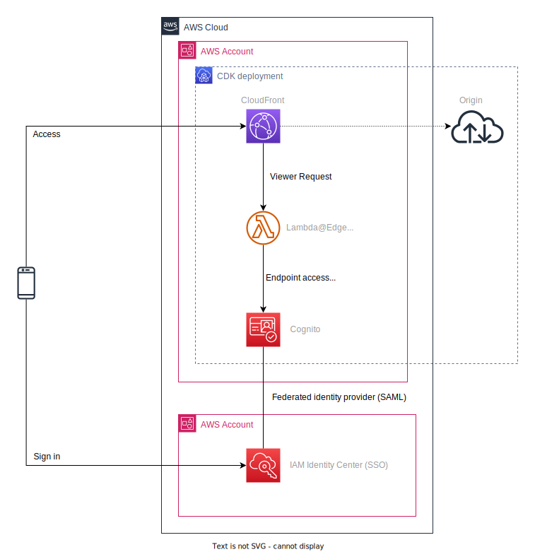
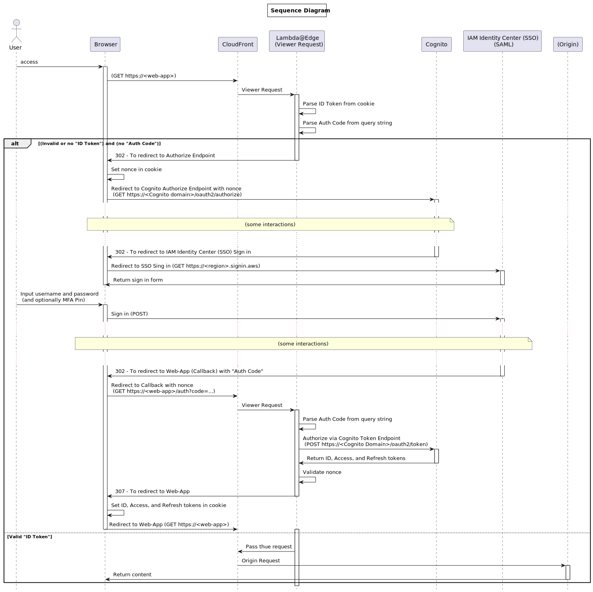

# Demo : Authorization using AWS IAM Identity Center (SSO) at CloudFront with Lambda@Edge

This is a demonstration for authorization using AWS IAM Identity Center (SSO) at CloudFront with Lambda@Edge.

Add a SAML identity provider with IAM Identity Center (SSO) to the Cognito User Pool to authenticate users. The user pool will return an ID, access, and refresh tokens. The ID token is a standard OIDC token, and the access token is a standard OAuth 2.0 token. You are allowed access to the web app without re-authentication until the ID token expire.

**This project is for demonstration purposes only, not for production environment.**

For more information, see the following documents: https://docs.aws.amazon.com/cognito/latest/developerguide/cognito-user-pools-saml-idp.html

## Architecture Overview



Following AWS resources are deployed by CDK:

* Amazon Cognito
* Amazon CloudFront
* Lambda@Edge and IAM Role

... and **you need to configure manually following AWS service**:

* IAM Identity Center (SSO)

## Request Flow



## Pre-Requirements & Limitations

* IAM Identity Center (SSO) must be preconfigured
* CDK must be installed and available
* Docker must be available (for bundling Lambda@Edge)
* In this demo, the origin is not accessed after authentication; Lambda@Edge returns html directly
* In this demo, not support Sing Out
* This project is for demonstration purposes only, not for production environment

## How To Deploy

(Sorry, but the deployment steps are a bit complicated...)

### 1. Decide Cognito Domain

First determine the Cognito domain, which must be a unique in the Region. **This demo does not support custom domain.**

### 2. Configure SSO Application

#### 2-1. Add Application

1. Open IAM Identity Center (SSO) in AWS Management Console
1. Choice **Applications** from left menu pane
1. **Add Application**
1. Select **Add custom SAML 2.0 application** and **Next**
1. In **Configure application** section, configure **Display Name** and **Description**
1. In **IAM Identity Center metadata** section, note the **IAM Identity Center SAML metadata** URL
1. In **Application metadata** section, configure **Application ACS URL** and **Application SAML audience**
    * **Application ACS URL** : `https://<Cognito Domain>.auth.<Cognito Region>.amazoncognito.com/saml2/idpresponse`
    * **Application SAML audience** : `urn:amazon:cognito:sp:<Cognito User Pool ID>`
        * (The User Pool ID is not known at this time, so set a temporary value and change it later. For example: `urn:amazon:cognito:sp:ABC`)
1. **Submit**

#### 2-2. Edit Attribute Mappings

1. Return to your application, then **Edit attribute mappings** in **Actions**
1. `Subject` attribute maps to `${user:subject}`, **Format** is `unspecified`
1. **Add new attribute mapping**
1. Input following values:
    * **User attribute in ...** : http://schemas.xmlsoap.org/ws/2005/05/identity/claims/emailaddress
    * **Maps to this string value ...** `${user:email}`
    * **Format** : `unspecified`
1. **Save changes**

#### 2-3. Assign User or Group

1. Return to your application, then choice **Assign Users**
2. Assing users or groups

### 3. Configure your context parameter

Configure `cognitoNamePrefix`, `cognitoDomain`, and `cognitoSamlMetadataDocEndpoint` in [`cdk.json`](cdk.json) like following:

* `cognitoNamePrefix` : the name prefix for User Pool, ID Provider and App Client names
* `cognitoDomain` : determined in the first step
* `cognitoSamlMetadataDocEndpoint` : the URL noted as **IAM Identity Center SAML metadata** in the previous step 2-1-6

(`cognitoCallbackUrl` is going to be replaced after other step.)

```json
{
  // :
  // (snip)
  // :
  "context": {
    // :
    // (snip)
    // :
    "cloudfront-lambdaedge-cognito-saml-auth": {
      "cognitoNamePrefix": "my-organization-sso",
      "cognitoDmain": "my-organization",
      "cognitoCallbackUrl": "https://TENTATIVE",
      "cognitoCallbackPath": "/auth",
      "cognitoSamlMetadataDocEndpoint": "https://portal.sso.us-east-1.amazonaws.com/saml/metadata/xxxxxxxxxx"
    }
  }
}
```

`cognitoNamePrefix` is the name prefix for User Pool, ID Provider and App Client names.

### 4. Deploy Cognito Stack

```bash
cdk deploy CognitoSamlAuthStack
```

After deployment complete, you cat get `User Pool ID`, `App Client ID`, and so on.

### 5. Update SSO Application SAML Audience

1. Open IAM Identity Center (SSO) in AWS Management Console
1. Choice **Applications** from left menu pane
1. Choice your application (linked application name)
1. **Edit configuration** in **Actions**
1. In **Application metadata** section, update **Application SAML audience** with Cognito user pool ID
    * For example : `urn:amazon:cognito:sp:us-east-1_ABCdefgh0`
1. **Submit**

### 6. Deploy CloudFront And Lambda@Edge Stack

```bash
cdk deploy CloudfrontLambdaEdgeStack
```

After deployment complete, you cat get `CloudFront distribution domain name` and so on.

### 7. Update Context Parameter

Configure `cognitoCallbackUrl` in [`cdk.json`](cdk.json) with CloudFront distribution domain which you got previous step like following:

```json
{
  // :
  // (snip)
  // :
  "context": {
    // :
    // (snip)
    // :
    "cloudfront-lambdaedge-cognito-saml-auth": {
      // :
      // (snip)
      // :
      "cognitoCallbackUrl": "https://dXXXXXXXXXXXXX.cloudfront.net",
      // :
      // (snip)
      // :
    }
  }
}
```

### 8. Update Lambda@Edge Function Code

Configure Cognito related values in [`assets/lambda-edge/app.py`](assets/lambda-edge/app.py). Lambda@Edge does not support environment variables, so edit the code directly.

```python
CONTENT_DOMAIN = 'dXXXXXXXXXXXXX.cloudfront.net'

COGNITO_REGION = 'us-east-1'
COGNITO_USERPOOL_ID = 'us-east-1_ABCdefgh0'
COGNITO_APP_CLIENT_ID = 'xxxxxxxxxxxxxxxxxx'
COGNITO_IDENTITY_PROVIDER='my-organization-sso-idp'
COGNITO_DOMAIN = 'my-organization'
```

### 9. Re-deploy CDK Stacks

```bash
cdk deploy --all
```

## Check Behavior

Access `https://dXXXXXXXXXXXXX.cloudfront.net` via your browser.  
**After authentication, Lambda@Edge does not forward the request to the origin for simplicity, but returns HTML directly.**

## How To Clean Up

You can clean up by following command:

```bash
cdk destroy --all
```

## Lisence

MIT